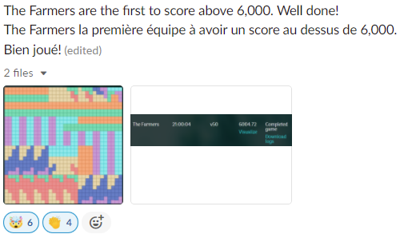

# CoveoBlitz 2022 Inscription

## Write-up

### Summary

This year, much like [last year's inscription challenge](https://github.com/JesseEmond/blitz-2021-chal) where we worked very hard (Python that calls into a C++ hard-coded HTTP server that parses ints and produces strings ASAP) all for only 12% more points compared to a 3-lines python solution, we went a bit overboard for just a few extra points on the leaderboard. :)

We are given a set of Tetris pieces and are asked to pack them as tightly as possible into (ideally) a square.

We started from a greedy solution in Python, then moved to Rust, while battling msanfacon@'s _ZeBoss_ on the leaderboard.... We got to a score of `~5990` points through mostly speed optimizations, until we got passed by the team _The Farmers_. The celebration post on _The Farmers_' score crossing `6000` gave a bit of an unexpected hint on their strategy, which we used as inspiration to do a bunch more work to get to our final score of `6012.50`. Both teams reached that score and mutually agreed to stop there, given that getting any higher was mostly based on luck.

This final score is just shy of the theoretical maximum of `6027.50`, which based on offline evaluations we find our solver has a `~0.11%` probability of hitting, which would have taken an expected `~929` runs to get.

### The Challenge

This year's challenge is about packing a given list of Tetris pieces (called `totems` in the challenge) on a grid in a way that maximizes a score.

A solution's score is given by the following formula, assuming `num_totems` total totems to place with a solution that spans a bounding box of dimensions `a x b` (assuming `a <= b`): `(10*num_totems - a*b) * a/b`. In other words: we are encouraged to pack the totems as tightly as possible, and are penalized for deviating from a square.

For some visual examples taken from the documentation, the following solution to packing the shapes `[L, O, J, I]` would grant a score of `24 = (4 * 10 - 16) * 4/4`:

```
I I I I
L O O J
L O O J
L L J J
```

While the following would grant a score of `10.67 = (4 * 10 - 24) * 4/6`:

```
. . J . . I
L . J . . I
L J J O O I
L L . O O I
```

Our solver is evaluated by summing our score on 10 levels, each asking us to pack a bag of random totems increasing in size (powers of 2):

`[1, 2, 4, 8, 16, 32, 64, 128, 256, 512]`.

For every level, we must give an answer **within 1 second**, or our answer is worth no points.

### Greedy Solution in Python

#### First solution: build up a square

We started this journey by getting taunted by Marc Sanfaçon -- Co-Founder & SVP Technology at Coveo (who we know quite well after so many years of _CoveoBlitz_) -- [on Twitter](https://twitter.com/msanfacon/status/1453454850948276224), for getting a `-1` score after pressing "go" before submitting a solution...

We had to quickly get something working then. We started in Python, and our initial approach picked the next shape (and rotation) based on which one kept the score the highest. It tried 4 possible positions for each: place the shape at the top left (increase height of solution), bottom right (increase width of solution), top (left-aligned, no height change), right (bottom-aligned, no width change), and pick whichever one gave a highest 'current' score. This gradually built up a structure that stayed close to a square shape overall.

<details>
  <summary>Visually, the choices look something like this:</summary>
  
  ```
                                 . . . . . .
                                 . . . . . .
                       +-------> . . L . S S  score=6
                       |  top    O O L S S .
                       |  (right O O L L . .
                       |  align)
                       |         . . . . .
   Current             |         . S S . .
    Board              +-------> S S L . .  score=14
  . . . . .            | top     O O L . .
  . . . . .            | left    O O L L .
  . . L . .  ----------|       
  O O L . .            |         . . . . . . .
  O O L L .            |         . . . . . . .
  Current score: 6     +-------> . . L . . . .  score=3.86
                       | bottom  O O L . . S S
  Trying shape: S      | right   O O L L S S .
                       |
                       |         . . S S .
                       |         . S S . .
                       +-------> . . L . .  score=8
                         right   O O L . .
                         (bottom O O L L .
                          align)
  
  We'd do this for every rotation of 'S', and for every other shape, and pick the highest
  (in this example, 'top left' seems to be the best, with a score of 14).
  ```
  
</details>

#### Twitter taunting

This worked okay. It gave us `519.96` points, still far below the inscription requirement, but high enough to start replying to Marc. We replied by asking him [where his score was on the leaderboard](https://twitter.com/JesseEmond/status/1453545833337589770?s=20). :) He followed up a few days later by sending screenshots of his score on the leaderboard! So it became a race to increase our points to make sure Marc wouldn't pass us... for now.

#### Greedy solution: try to fit target dimensions

While that original greedy approach works, optimizing our local "current" score isn't optimal -- we know how many totem pieces we have to place, we can work at a more global scope by instead deciding on ideal final dimensions and trying to fit the totem pieces within those dimensions. If we have `n` totems, we know that we have `4 * n` cells to fill (each totem has 4 pieces), and we know that we ideally want square dimensions to maximize our score. One sensible approach is to start from a square that can cover all our totem cells as tightly as possible (a square with a side of `ceiling(sqrt(4n))`), try to fit our pieces, and increase our square's side length by 1 if we couldn't. Do this until we can pack our totems.

To try and fit the pieces, our next greedy approach did the following: for each totem left to place, for each possible rotation of that totem, for every *x* position where we could place it (at its lowest _y_ position, a bit like Tetris falling pieces), pick the one that would have the most "touchpoints", i.e. cells that would touch the most other already-placed totems or grid borders. The rationale for this was to pick a fast heuristic that would minimize the created unrecoverable "holes" by encouraging placements that had their sides touching as many other pieces/borders as possible. We experimented with more advanced heuristics e.g. to detect whenever we would create an unrecoverable gap in our grid, but the extra compute cost of doing so made it hard to justify.

Visually, the touchpoint counts look something like this:
  
  ```
                                                                    +-----------+
                                                                    |           |
                                                                    |           |
                                                            +-----> |     # 1   |  touchpoints=7
                                                            |       | ##### 2 1 |
                                                            |       | ####### 3 |
     Current          Touchpoints                           |       +-----------+
      Board                                                 |
  +-----------+      +-----------+                          |       +-----------+
  | . . . . . |      | 2 1 1 1 2 |                          |       |           |
  | . . . . . |      | 1 0 1 0 1 |                          |       |   0 1     |
  | . . L . . |      | 2 2 # 1 1 |  When considering  ------+-----> | 2 2 #     |  touchpoints=5
  | O O L . . |      | ##### 2 1 |  "S" placements          |       | #####     |
  | O O L L . |      | ####### 3 |                          |       | #######   |
  +-----------+      +-----------+                          |       +-----------+
                                                            |
                                                            |       +-----------+
                                                            |       |     1 1   |
                                                            |       |   0 1     |
                                                            +-----> |     #     |  touchpoints=3
                                                            |       | #####     |
                                                            |       | #######   |
                                                            |       +-----------+  
                                                            |
                                                           ...
  
  Based on these choices, the first placement would be preferred over the other 2 displayed above.
  ```

#### Getting to 5700+ points

Surprisingly, that greedy approach did really well and iterating on this approach helped us get to the `5700+` points range, by introducing randomness for placements with equal touchpoints and trying multiple times with that randomness as fast as possible within our 1 second window.

But, as we improved our score on the leaderboard, so did Marc's. He kept replying on the thread with pictures of his score going up, and so did our anxiety levels. We had to dive a bit more in the challenge details to know where to focus our attention to squeeze out more points.

### Challenge Levels Detailed

#### Optimal solution dimensions

The previous intuition for always prioritizing squares made some sense at the higher levels with more totems, but not for the lower levels. There are cases where a rectangle is better than the square with `side+1`, e.g. for 2 totems, picking a rectangle with shape `2x4` over a `4x4` square is preferred, when we can't fit a `3x3` square.

For example, for level 3 (4 totems), the list of dimensions we should try to pack (in order) looks like this:

```
                                                                                                                 # # # # # #
                                    # # # # #                                                                    # # # # # #
  # # # #          # # # # #        # # # # #                                                                    # # # # # #
  # # # #     >    # # # # #    >   # # # # #    >   # # # # # #   >   # # # # # # #   >                     >   # # # # # #   >   ...
  # # # #          # # # # #        # # # # #        # # # # # #       # # # # # # #       # # # # # # # #       # # # # # #
  # # # #          # # # # #        # # # # #        # # # # # #       # # # # # # #       # # # # # # # #       # # # # # #
4x4 (24 pts)      5x4 (16 pts)     5x5 (16 pts)      6x3 (11 pts)      7x3 (8.14 pts)        8x2 (6 pts)         6x6 (4 pts)
```

We made a helper class `OptimalDimensions` that would generate an ordered list of optimal dimensions to try at a given level; dimensions that could potentially fit our number of totems, while maximizing the score. This can sometimes lead to picking rectangles when we can't fit our totems in the smallest square. This helped get more points on lower levels, mostly.

This is relevant for runs where we are unable to pack the optimal dimensions -- we can then get the next best score, but note that to score high on the leaderboard, we become more and more mostly concerned about having the ability (or luck) to obtain the optimal scores for each level, and the further sections will explore the goal of maximizing our probability of successfully packing the optimal dimensions.

#### The easier levels

It turns out that the hardest level is not the 10th with 512 totems, and that the greedy approach is good enough to almost always successfully pack levels to the "optimal" scoring dimensions, as long as the level number is pair. This is because the number of totems per level is essentially `2^(level-1)`, so the number of cells to cover is `4 * 2^(level-1) = 2^2 * 2^(level-1) = 2^(level+1)`, and this exponent is odd when `level` is even. When that is the case (odd exponent), `sqrt(num_cells)` doesn't give us an integer, so there is no square that would exactly fit all of those totems. By going to the first square that would fit them with `ceiling` (which is also still what gives the optimal score for all levels), we then have some wiggle room when packing our totems (some cells will stay empty in the end), which gives us room for suboptimal packing and makes it easier.

For example, with 512 totems, the optimal dimensions to maximize the score are `46x46`, which leaves room for `46*46 - 512*4 = 68` "holes" in our solution -- much easier to solve! And, it happens that our greedy solver is able to pack the even levels optimally almost always for levels `4`, `6`, `8`, and `10`. Note that level `1` is also trivial, since the server always sends an `I` it seems (which is what the starter kit sends by default), so we are bound to receive a score of `(1*10 - 4*1) * 1/4 = 1.5` on the level 1 in any case.

<details>
  <summary>Here is an example 512 totems challenge solved in its optimal `46x46` dimensions where you can visualize the room for error.</summary>
  
```
TTTT.S.OO............OOOO.SS.STTTOOTTTTTTT.JJJ
TTTOOSSOOOOOOOO......OOOOSSOOSSTTOOTTTTTTSTTTJ
TOOOOSSOOOOOOOO......OOOOOOOOTSTTTTTTTTTTSSTTI
SOOOOSSOOOOOOOO......OOOOOOSTTTTTTTTTTTTSSSTTI
SSSOOSSOOOOOOOO.....OOOOOOSSSTTTSSTSSSSSSTTTTI
TSSSSSSOOOOOOOO.....OOOOOOSSSTTSSTSSSSSS.TTJJI
TTTSSSSOOOOOOOO......OOOO..SSSTTTTTSSSSTTTTJJI
TTTTSSSOOOOOOOOOO....OOOOOOSSTTTTTSSSSTTTOOJJI
OOOOSSSSSOOOOOOOO....OOOOOOTTTTTTTTSSSSSSOOJJI
OOOOTSTSSSOO..OOOOOO.OOOOTTTTTTTTTTTSSSSTJJSSI
ZZLLTTTTTSOOOOOOOOOOSSSSTTTTTTTTTTTSSZTTTJSSZI
LZZLTTTTTTOOOO.OOOOSSSSTTTTTTTTTTTSSZZTTTJLZZI
LLLLTTTOOTOOOO.OOOOSSSSSTTTTTTTTTTSSZZTZLLLZZI
LLLSLLTOOTTTOOOOOOSSSSTSSTTTTTTTTSSTZZZZSSZZZI
ZZLSSLTTSTTTT.OOOOTTTTTTSTTTTTSSTTTTZZZSSZZZLI
IZZJSLTTSSZZZZZZTTTTTTTSTTTTTSSSSTTTZZZJJZLLLI
ILSJJJTTTSTZZZZZZTTZZTTSSTTTTTSSTTTTZZZJLLLLJI
ILSSSLLZZTTTTZZZZTTTZZTTSTTTSSTTTTTTTZZJLLLLJI
ILLSSSLLZZSTTTZZZZOOOOTTTTTSSTTTTTTTTZZJJZJJJI
IISZZSLLZZSSLSZZZZOOOOTTTTSSSSSSTTTTTZZJZZJJJI
IISSZZLLLZZSLSSZZZZZZZZZZSSSSSSTZZZZTZZJZJJJII
IIJSLLLLLJJJLLSSLLLSZZZZZZZZZZTTTZZZZZLJJSSJII
IIJJJLLLLZZJJJJSSLLSSZZZZZZZZZZZLLLLLLLJSSZIII
IIIIILZZLSZZZZJLSLLLSTZZZZZZOOZZLLLLJJZJZZZIII
LSLLIZZZZSSLSZZLZZZZTTTSSLLLOOZLLLLLJZZZZZLIJI
LSSLIJZZZZSLSSJLLZZZZLSSLLTTTLLLLLLLJZZZLLLIJI
LLSLIJJJJZZLLSJJJJJJJLLLLZZTLLLSSLLLJZZIJJIJJI
IJJJJJJJJJJJJJSLLJJJJLLTTTZZLLSSZLSSJZIIJJIIII
IJJJJZZJLLSZZJSSLSLLLJJJTZZLLLLZZSSJJZIIJJIIII
IJIIIIZZLLSSZZSSLSSLLZZJLJZZLLLZLLLJZZIIJJIIII
IJJJLSLLLLSSLLSSZZSLLLZZLJJJJJJZLSSJZZIIIIIIII
IIILLSSLLLSSLLSSJZZLJJJJLLSSJJZZSSJJZZIIIILLLI
IIILLLSLJJJSLLSSJJJLJJJJLSSJJJZLLLLJZZIIIILSSI
IIILLIIIISJLLLSSJJJLLJLLLSSSSSSLLLLJZZJJJJSSJI
IIIIIIIIISSLZZSSLSJLJJJJSSSSSSZJJJJJZIJJJJJJJI
IIIIIIIIIJSLLZZSLSSLJJJOOLLLLZZJJIIIIIJJJJJJJI
IIIIIIIIIJJJZZLLLLSLLSSOOLLLLZJJJLLLLIJJJJJLII
IIIIIJJJIJJJJZZLJJJJSSLLLLLLLLLLLLLLLILLLLLLII
IIIIIIIJILSJJJJLJJJJLLLLLLLLZZLIIIILLLLLLLZJII
JJJIZZLLILSSZZZZIIIIIIIISIIIIZZIIIILLLLLLZZJII
ZZJILZZLILLSJZZZZIIIIJJJSSIIIIIIIIJJLLLLLZJJJI
JZZILLLLSJJJJJJIIIIIIIIJTSIIIIIIIIJLLLIIIISSJI
JJJILLLSSSJJTTTIIIIIIIITTTIIIISSSSJZJIIIISSJJJ
LJJJLSLSSSJJJTIIIIIIIILLLIIIISSSSZZZJLLLLIIIIJ
LZZJLSSJSZZIIIITTTIIIILIIIIIIIILZZZJJLLLLLLLJJ
LLZZLLSJJJZZIIIITIIIIIIIIIIIILLLZIIIIIIIILIIII
```
  
</details>

#### The hard levels

On the other hand, this means that every odd `>1` level requires a perfect packing to get the optimal score -- the number of cells for the amount of totems to place can theoretically perfectly fit in a square. This makes levels `3`, `5`, `7`, `9` particularly hard. For example, for level 9, we are given 256 totems and must place them perfectly in a `32x32` grid, with no holes anywhere. Note that this problem is analogous to 2d bin packing in some ways (with a single bin and no room for waste) and is likely in NP, too.

Here is an example level 9 challenge, where we successfully perfectly packed 256 totems in a `32x32` grid, for a well-earned `1536` points:

```
+-----------------------------------------------------------------+
| I J J J L L L Z O O O O L L L T T T T T I J J J L L L Z J J O O |
| I J J J L Z Z Z O O O O L S S T T T T T I J J J L Z Z Z J S O O |
| I J O O Z Z Z L O O O O S S L T T Z Z T I J O O Z Z Z L J S S J |
| I J O O Z L L L O O O O L L L T T T Z Z I J O O Z L L L O O S J |
| I I I O O J J J L S L L I I I O O J J J L L L T T T T T O O J J |
| I I I O O S S J L S S L I I I O O S S J L S S T T T T T I I I I |
| I I I J S S O O L L S L I I I J S S O O S S L T T Z Z T I I I I |
| I I I J J J O O L L L L I I I J J J O O L L L T T T Z Z I I I I |
| I I I O O J J J L L L L I I I O O J J J Z Z Z Z Z Z L L L L L L |
| I I I O O S S J T T T Z I I I O O S S J L Z Z Z Z Z Z L L L L L |
| I I I J S S O O T T Z Z I I I J S S O O L Z Z Z Z Z Z L T T T Z |
| I I I J J J O O T T Z T I I I J J J O O L L Z Z Z Z Z Z T T Z Z |
| J J J J J J O O T T T T L L L S S S S Z Z Z Z Z Z Z L L T T Z Z |
| Z Z J Z Z J O O T T T T L Z S S S S Z Z L Z Z Z Z Z Z L T Z Z Z |
| J Z Z J Z Z O O L S L L Z Z S S S S Z L L Z Z Z Z Z Z L Z Z Z L |
| J J J J J J O O L S S L Z S S S S L L L L L Z Z Z Z Z Z Z L L L |
| I I I O O J J J L L S L I I I O O J J J O O O O L L L T T T T T |
| I I I O O S S J T T T Z I I I O O S S J O O O O L S S T T T T T |
| I I I J S S O O T T Z Z I I I J S S O O J J Z J S S L T T Z Z T |
| I I I J J J O O T T Z T I I I J J J O O J Z Z J L L L T T T Z Z |
| L L L S S S S Z T T T T I I I O O J J J J Z J J I I I O O J J J |
| L Z S S S S Z Z T T T T I I I O O S S J J J Z J I I I O O S S J |
| Z Z S S S S Z L L S L L I I I J S S O O J Z Z J I I I J S S O O |
| Z S S S S L L L L S S L I I I J J J O O J Z J J I I I J J J O O |
| I I I O O J J J L L S L J J O O T T T Z Z Z Z Z Z Z L L J J O O |
| I I I O O S S J L L L L J S O O T T Z Z L Z Z Z Z Z Z L J S O O |
| I I I J S S O O L L L L J S S J T T Z T L Z Z Z Z Z Z L J S S J |
| I I I J J J O O L L L L O O S J T T T T L L Z Z Z Z Z Z O O S J |
| L L L T T T T T L L L L O O J J T T T T I I I O O J J J O O J J |
| L S S T T T T T L L L L I I I I L S L L I I I O O S S J I I I I |
| S S L T T Z Z T O O L L I I I I L S S L I I I J S S O O I I I I |
| L L L T T T Z Z O O L L I I I I L L S L I I I J J J O O I I I I |
+-----------------------------------------------------------------+
```

#### The luck factor

While our packing algorithm plays a very important part in how likely we are to find a perfect packing on the hard levels, we are still limited somewhat by the set of totems we are given. For example, for 2 totems (level 2), we can only reach the optimal score of `11.0` on a `3x3` grid for some pairs of totems (two `O` totems can't fit in a `3x3` grid, for example).

The optimal packing probabilities are shown lower in the README, but to get an idea of the luck involved, even with a packer that tries every possible placements, we have a `28.6%` probability of getting totems that can fit in the optimal dimensions for level 2, and `9.2%` for level 3. For higher levels, it is even harder to estimate the true packing probability given the sheer amount of possible combinations involved, but they also involve some luck in the set of totems that we are given.

Based on this, the best we can do is try to maximize our probability of optimally packing each level, and rerun a couple of times until we get reasonably lucky!

### Faster Solution in Rust

#### Getting to 5900+ points, racing with Marc

Around that point, Marc had finally passed us on the leaderboard. We got back to work. Knowing that rerunning our greedy solver multiple times in a loop could improve our probability of getting an optimal packing (due to the randomness in how we pick equivalent placements), we focused on speeding up our solver to increase the amount of attempts we can make in the 1 second limit to try get a higher score.

Thankfully, this year Coveo gave us the option of using Rust, which saved us from having to use our painful trick from [last year's inscription challenge](https://github.com/JesseEmond/blitz-2021-chal), where we were using Python just to call into our true C++ implementation.

By rewriting our greedy solver in Rust and optimizing a bit, we were able to get in the `5900+` points range after some work. That was enough to [reply back](https://twitter.com/JesseEmond/status/1454596178532880386) to Marc's taunt with our `5914.50` score and breathe a little. The code for this solver lives in `greedy_solver.rs`.

But just a few days later, Marc replied again, this time including a screenshot of the leaderboard where he beat our hard-earned `5914.50` points with `5964.97` points, along with [a comment](https://twitter.com/msanfacon/status/1456255330367643652) that he had "found 10 minutes to rework his algorithm"...

...Only 10 minutes? We were wondering what we were missing, clearly there must be a better way to get perfect packings on those higher levels, we must have been approaching this from the wrong angle and there must be an easier solution that we couldn't see...

...

Then Marc [replied](https://twitter.com/msanfacon/status/1456255330367643652) the next day, saying that the hardest part was really connecting to the VPN and to the DB, with a picture of the leaderboard of him with a score of `31415.92` points on the challenge, which is simply theoretically impossible... :)

Apparently the whole time he wasn't really participating, he was just telling the Blitz team every once in a while that he "worked hard on it today, and thinks he's... about 1 point away from first place now".

Amazing. We completely fell for it and this is hilarious. Well played Marc, well played.

#### Getting to 5990+ points

But we still wanted to beat his fake `5964.97` score, so we got back to work. We made some tools to evaluate our optimal packing probability on a given level, which also made it easier to profile our solver by having a long-running process. The packing probabilities are pretty noisy sometimes, so this was also a chance to learn about the [Wilson score](https://en.wikipedia.org/wiki/Binomial_proportion_confidence_interval#Wilson_score_interval) interval to show a 95% confidence interval on our binomial proportion in our tool.

With this evaluation tool, we saw that our greedy approach worked pretty well on most levels, but had an almost null chance of ever getting the perfect pack on the 256 totems level. Because going faster means we can run more attempts in 1 second and get a higher packing probability, we profiled and optimized. Some noteworthy speed-ups came from:

- Representing our grid as a list of rows with `u64` ints, since we never go as high as a width of 64. We can also pre-compute the 64-bit "masks" of each totem rotation, then checking if a totem fits on a given row amounts to doing a bit-and between 64-bit integers;
  For example (using `u8` for simplicity):
  ```
  This grid:  +-----------------+
              | L L L . . . . I |
              | L L L . . . . I |
              | O O L . S S . I |
              | O O L S S . . I |
              +-----------------+

  As 4 u8 ints     Check for
    0b11100001      'T' fit:     Collisions:
    0b11100001  &  0b00011100  = 0b00000000
    0b11101101  &  0b00001000  = 0b00001000
    0b11111001
  ```
- Keeping track of "lowest unset `y` so far" for each `x` position. With this, when finding the first vertical position where a given totem rotation could fit we can _start_ at this lowest possible position, moving up afterwards, skipping loop iterations as the grid grows;
  Visually:
  ```
  For board:            We keep track of '*':    So now, when we place 
  +-----------------+   +-----------------+      a totem, we know it
  | . . . . . . . . |   |         * *   * |      must fit at least >=
  | . . . . O O . J |   |       * x x   x |      the '*'s for each
  | . . . T O O . J |   |   *   x x x * x |      column it occupies.
  | . S S T T . J J |   | * x   x x x x x |
  | S S . T I I I I |   | x x * x x x x x |
  +-----------------+   +-----------------+
  ```
- Running multiple greedy solvers in parallel in different threads. We printed CPU information on the server and found that we were likely running on a `c5a.2xlarge`, giving us 4 cores to work with (using the 8 hyperthreaded cores would likely [not be a good idea](https://www.credera.com/insights/whats-in-a-vcpu-state-of-amazon-ec2-in-2018) for our compute-bound processing);

We also implemented an "exhaustive solver" that tries every possible placement with similar optimizations, to ensure that we find the optimal packing when possible for those lower levels. Note that we are only able to run it on <= 8 totems, for >= 16 it takes too long (especially with our 1 second constraint).

With this, combined with an `automate.py` script that ran overnight (script that re-launches our solver on the server every 2-3 minutes  using the same behind-the-scenes GraphQL API as the challenge website is using), we were able to get a score of [`5994.50`](https://twitter.com/JesseEmond/status/1457357117778706436), beating Marc's last feasible fake score. Looking it up, we had gotten lucky with a perfect pack on the `256` totems level, which only had a probability of about \~0.2% in our offline tool!

### Rectangle Packing, Inspired by _The Farmers_!

#### _The Farmers_ :eyes:

A bit after that, the team _The Farmers_ passed us on the leaderboad (this time real participants!), getting a score of `5995.50`. Then later `6004.72`. Wow! Clearly they were doing something much better, and computing the scores offline we saw that a score of `6004.72` amounted to getting every level at the optimal score, aside from level 2 and 5. Very nice!

At some point, to celebrate the first team crossing 6000 points and to showcase how impressive a perfect fit with 256 totems is, the CoveoBlitz team shared a screenshot of one of the solutions by _The Farmers_... :eyes:



What immediately stood out to us was the pattern of smaller rectangles (\~4x8 dimensions) in their solution, which hinted at the use of an approach that we had briefly considered: precompute possible rectangles offline, and try to fit rectangles on-the-fly instead. We had scratched that idea off because our "lucky" 256 pack with our greedy solver had no clear possible rectangular separations, so we mistakenly thought that focusing on rectangles would either not work or ignore too big of the solution space. Clearly that was a wrong call.

So we decided to try implementing a precomputed rectangle packing solver for the harder levels, to see if this would yield a similar score. Credits to _The Farmers_ for the idea here, otherwise we wouldn't have known that this was an approach that was truly feasible.

#### Precomputing rectangles offline

We pre-computed offline, for every possible combination of totems (every possible "totem bag"), all rectangles that could be made, up to an area of `32`. To do so, we could have used our previous "exhaustive" solver, but instead tried a different approach based on what we found reading online.

Checking if a totem bag can fit an `a x b` rectangle (or our odd levels also) can be reformulated as a an ["exact cover"](https://en.wikipedia.org/wiki/Exact_cover) problem, which can be seen as defining a matrix with columns being our "constraints", and rows being possible "assignments" in terms of our constraints with `0` and `1` values, and where we try to find a selection of rows such that overall `1` appears in each column exactly once.

[This link](https://toddtaomae.wordpress.com/2014/08/07/solving-the-tetris-cube/) was particularly helpful to understand how to reformulate a polyomino tiling problem as an exact cover problem: we can define each possible `(x, y)` position as its own column, as well as each totem that we have to place as its own column. Our final solution must have each column covered exactly once -- we want every position in our grid to have a totem on it (in the context of a perfect fit) and every totem to be placed. We can thus create rows for each totem, for every one of its rotations, at every possible assignment it could have on the grid. When we find an "exact cover" solution, we then have a list of rows that maps to placements of totems on our board.

To solve an exact cover problem, Donald Knuth developed the "Algorithm X", using a data structure he called ["Dancing Links"](https://arxiv.org/pdf/cs/0011047.pdf) as an internal representation that facilitates reverting the deletion of a node from a circular doubly linked list. It is quite interesting a worth reading more into! There's this neat [blog post](https://ferrous-systems.com/blog/dlx-in-rust/) about implementing DLX (Dancing Links X) in Rust, but for simplicity we used a `dlx` package and called that. The code for this solver that maps between totem packing and exact cover problems is in `dlx_solver.rs`.

We coupled this with a `RectangleInventory` structure to keep track of precomputed rectangles and their cost in terms of totems, and precompute them and store them to disk offline using `bin/precompute_rects.rs`. For our online solver, it loads in the precomputed rectangles from disk at initialization. We precomputed all rectangles made up of totems up to area 32.

Here are some of those precomputed rectangles:

```
3x8            3x8            4x7                    4x8
{2xI,2xT,2xZ}  {1xI,4xJ,1xO}  {2xI,1xL,1xO,1xS,2xT}  {1xJ,2xL,1xO,1xS,2xT,1xZ}
T T T          J J J          S T T T                L L L L
I T Z          J J J          S S T T                L L O O
I Z Z          J O O          I S T T                L L O O
I Z I          J O O          I O O T                T T T Z
I Z I          I J J          I O O L                S T Z Z
Z Z I          I J J          I L L L                S S Z T
Z T I          I J J          I I I I                J S T T
T T T          I J J                                 J J J T
```

#### "Subset-sum" (with repeat) to get rectangle candidates

Next, we needed a way to get, for a given challenge's totem bag, a combination of precomputed rectangles that have costs that sum exactly to our inventory. This is a bit analogous to a multi-dimensional subset sum problem, except that we are also allowed to reuse the same precomputed rectangle multiple times (it's more of a blueprint). It is also analogous to the knapsack problem, except our weight is again multidimensional and we want to exactly match our limit.

There might be better theoretical tools to solve this problem quickly, but we went with a simple approach that bruteforces and backtracks, trying a rectangle, calling itself recursively, and remembering totem bags that lead to dead-ends. This logic lives in `subset_sum.rs`, and `MultiDimSubsetSumIterator` gives us candidate lists of rectangles that we can exactly afford for a given totem bag. Note that we sometimes can't find combination of rectangles that would sum to our bag fast enough, so we include a max number of backtracks to give up at some point (and then maybe retry with a shuffled list).

Here's what an example solution might look like:

```
For a challenge with the following totem bag (for a 16x16 64 totems level):
            I   J   L   O   S   T   Z 
          [ 8, 13, 10, 13,  4,  8,  8]
Use these rectangles from our inventory:
Rect 4x8  [ 3,  3,  1,  0,  1,  0,  0]
Rect 4x8  [ 3,  3,  1,  0,  1,  0,  0]
Rect 4x8  [ 0,  0,  1,  0,  2,  2,  3]
Rect 4x8  [ 2,  2,  1,  0,  0,  2,  1]
Rect 4x7  [ 0,  1,  2,  2,  0,  2,  0]
Rect 4x4  [ 0,  0,  2,  0,  0,  0,  2]
Rect 4x4  [ 0,  0,  2,  0,  0,  0,  2]
Rect 4x7  [ 0,  2,  0,  5,  0,  0,  0]
Rect 4x4  [ 0,  0,  0,  4,  0,  0,  0]
Rect 4x5  [ 0,  2,  0,  1,  0,  2,  0]
Rect 2x2  [ 0,  0,  0,  1,  0,  0,  0]
```

#### Monte-Carlo Tree Search for rectangle packing

Once we have a set of rectangles that we know sum up to our totem bag, we are left with the task of finding a way to pack those rectangles on our grid dimensions. This is closer to traditional 2d bin packing and some resources were helpful. We ended up going with the approach in the paper [Monte carlo tree search on perfect rectangle packing problem instances](https://www.researchgate.net/publication/343895750_Monte_carlo_tree_search_on_perfect_rectangle_packing_problem_instances).

This checks every rectangle left to place (possibly rotated), tries placing it, then runs a few simulations from that state, where rectangles to place are picked at random until we get stuck (or place them all -- then we're done). The placement that gave the best "score" (either average or max depth reached in the simulations) is picked. Iterate until we don't have rectangles that can be placed, or until we find a simulation that placed all rectangles! The logic for this solver (get set of rectangles + try to pack them) is in `rect_packing_solver.rs`.

Each rectangle placement is done deterministically, using a common bin packing heuristic: [Bottom-Left](https://www.cs.princeton.edu/~chazelle/pubs/blbinpacking.pdf). This places the rectangle at its lowest possible position, left-aligned.

#### _MaxRects_ to track free space

Initially, to find the *Bottom-Left* fit of a rectangle, we kept track of a grid of masks, similar to our greedy solver. Iterating through the possible x/y placements to find the bottom-left fit was too slow and prohibited the use of this solver for the `256` totems under 1 second.

Instead, we switched to the use of a `MaxRects` representation to keep track of the unused space, based on [this paper](http://pds25.egloos.com/pds/201504/21/98/RectangleBinPack.pdf) about rectangular bin packing. It amounts to tracking empty spaces as a list of rectangles, in a way where they are maximally extended horizontally and vertically (hence the free space rectangles can overlap). We start with a `w x h` empty space, then when we place a rectangle, we split our empty space in up to 4 rectangles, where each one of them is maximally stretched.

Visually, `MaxRect` track empty space like this:

```
 Initial, empty     Place a bottom-left rect     Split into 2 maxrects (overlapping)
+---------------+      +---------------+           +---------------+
|///////////////|      |///////////////|           |>>>>>>>>xxxxxxx|
|///////////////|      |///////////////|           |>>>>>>>>xxxxxxx|
|///////////////|      | R R R R //////|           +-------+<<<<<<<+
|///////////////|      | R R R R //////|                   |<<<<<<<|
|///////////////|      | R R R R //////|                   |<<<<<<<|
+---------------+      +---------------+                   +-------+
```


The advantage of this representation is that we can easily find the Bottom-Left placement of a rectangle by picking the lowest, left-aligned `MaxRect` free space that fits it, at the cost of extra bookkeeping due to the overlap between our `MaxRects` (so when we place a rectangle we must check all other `MaxRects` to see if we should split them as well, and we remove redundancy by cleaning up `MaxRects` that are fully contained by others).

### Getting to 6012.50 points

We combine all this into an hybrid solver. This solver first tries the optimal dimensions that would maximize our score on the level, then proceeds to the next optimal dimension if our sub-solver couldn't find a solution.

The solver for a given level and dimensions is picked based on this logic:

- *<= 8 totems*: **exhaustive solver**, if there's a fit, we'll find it.
- *64 or 256 totems and dimensions require a perfect fit*: **rectangle packing**, considerably increases our odds of a perfect fit compared to greedy.
- *otherwise*: **greedy solver**, this is fast and gets the optimal score on every even level. For 16 totems, seems to be doing very slightly better than rectangle packing, so use it there as well.

With this, we were able to get `6012.50` points, which _The Farmers_ quickly tied as well!

In retrospect, it is very sad to do all this extra work only for two levels, and only for a few extra points, but this does remind us of last year's Blitz inscription challenge in that way...

Our approach is likely overcomplicated so we are eager to hear about the solution by _The Farmers_, but we also learned a lot in the process, which is really the most important part.

### Probability of a Perfect Score

For fun, let's compute what is the optimal score that we could get, and what would be the probability of our solver getting the perfect score (or expected number of runs to get it). With our offline evaluation tool, we can get a rough idea and chain the probabilities at the end (taking into account the hard-coded level 1 `I` challenge):

| Level  (# totems) | Optimal score  (dimensions) | Solver used  | Probability with our solver |
| ----------------- | --------------------------- | ------------ | --------------------------- |
| 1  (1 totem)      | `1.5      (1x4)`            | Exhaustive   | 100.0%                      |
| 2  (2 totems)     | `11.0     (3x3)`            | Exhaustive   | 28.6%                       |
| 3  (4 totems)     | `24.0     (4x4)`            | Exhaustive   | 9.2%                        |
| 4  (8 totems)     | `44.0     (6x6)`            | Exhaustive   | 99.9%                       |
| 5  (16 totems)    | `96.0     (8x8)`            | Greedy       | 44.5%                       |
| 6  (32 totems)    | `176.0  (12x12)`            | Greedy       | 100.0%                      |
| 7  (64 totems)    | `384.0  (16x16)`            | Rect packing | 48.7%                       |
| 8  (128 totems)   | `751.0  (23x23)`            | Greedy       | 100.0%                      |
| 9  (256 totems)   | `1536.0 (32x32)`            | Rect packing | \~18.9%                     |
| 10  (512 totems)  | `3004.0 (46x46)`            | Greedy       | 100.0%                      |
| **TOTAL**         | **6027.50 points**          | **Hybrid**   | **0.11%**                   |

So to get the perfect score of `6027.50` points, we would have needed, on average, about 929 runs. If we're re-running every 2 minutes, that's \~31 hours, which is clearly within reach. :) But at that point, both our team and _The Farmers_ agreed that we could reach that and that it was mostly luck-based then, so we agreed to stop there and call it a tie.

But can still simulate getting our perfect score offline using `bin/perfect_score.rs`, and it's quite glorious when we do get it:

<details>
  <summary>Logs of a perfect score run</summary>
  
```
Round #573
Received question with 1 totems.
Optimal dims for level 1 would be 2x2, which would give score 6
Skipping 2x2 (would have given 6), could not fit 1x4 totem
Skipping 3x2 (would have given 2.6666667), could not fit 1x4 totem
Skipping 4x1 (would have given 1.5), could not fit 1x4 totem
Trying 1x4... would give 1.5... Using exhaustive packer (slow) for 1x4 on 1 totems.
OK!
I
I
I
I
1x4, 1 totems, score=1.5
Took: 0ms
Received question with 2 totems.
Optimal dims for level 2 would be 3x3, which would give score 11
Trying 3x3... would give 11... Using exhaustive packer (slow) for 3x3 on 2 totems.
OK!
LLL
L.L
LLL
3x3, 2 totems, score=11
Took: 0ms
Received question with 4 totems.
Optimal dims for level 3 would be 4x4, which would give score 24
Trying 4x4... would give 24... Using exhaustive packer (slow) for 4x4 on 4 totems.
OK!
JJJJ
JJJJ
IIII
IIII
4x4, 4 totems, score=24
Took: 0ms
Received question with 8 totems.
Optimal dims for level 4 would be 6x6, which would give score 44
Trying 6x6... would give 44... Using exhaustive packer (slow) for 6x6 on 8 totems.
OK!
OO.ZZ.
OOZZZZ
.JTZZT
.JTTTT
JJTZZT
IIIIZZ
6x6, 8 totems, score=44
Took: 0ms
Received question with 16 totems.
Optimal dims for level 5 would be 8x8, which would give score 96
Trying 8x8... would give 96... Using multithreaded greedy packer for 8x8 on 16 totems.
OK!
LSTTTSST
LSSTSSTT
LLSOOOOT
LLTOOOOZ
LLTTOOZZ
LLTTOOZT
LLTTTTTT
IIIITTTT
8x8, 16 totems, score=96
Took: 0ms
Received question with 32 totems.
Optimal dims for level 6 would be 12x12, which would give score 176
Trying 12x12... would give 176... Using multithreaded greedy packer for 12x12 on 32 totems.
OK!
OOOO.....TTT
OOOO....SSTT
OOOO...SSTTT
OOOO...SSTTT
OOZZZZSS.TZJ
OOJZZZZOOZZJ
LLJJJSSOOZJJ
LLZZSSOOIIII
LLJZZJOOJJSS
LLJJJJJJJSSL
IIIIIIIIJLLL
IIIIIIIIIIII
12x12, 32 totems, score=176
Took: 0ms
Received question with 64 totems.
Optimal dims for level 7 would be 16x16, which would give score 384
Trying 16x16... would give 384... Using multithreaded MCTS rectangle packer for 16x16 on 64 totems.
OK!
IILSZZLLOOOOTTTT
IILSSZZLOOOOTTTT
IILLSZZLOOOOTTST
IIIIIIZZOOOOTTSS
LLLZSTTTJJOOTTSS
LZZZSSTTJJOOTTSS
ZZZISSTTJJJJTTTS
ZSSISSSTOOOOTTTT
SSLIJSSSOOOOLLLZ
LLLIJJJSOOOOLZZZ
IIIIJJJJOOOOZZZI
IIIIJJJJJJOOZSSI
IILSZZLLJJOOSSLI
IILSSZZLJJJJLLLI
IILLSZZLJJJJIIII
IIIIIIZZJJJJIIII
16x16, 64 totems, score=384
Took: 1ms
Received question with 128 totems.
Optimal dims for level 8 would be 23x23, which would give score 751
Trying 23x23... would give 751... Using multithreaded greedy packer for 23x23 on 128 totems.
OK!
LLLLZTTTTOO..OOOO..TJJJ
LLLZZTTTTOO..OOOOSTTLLJ
LLLZSTTTTT...OOS.SSTZLI
LLLLSSTTZOO..OOSSSSZZLI
LLLLSSTZZOOOO.SSSSSZZII
LLLLSSSZOO.OOSSSZZSZZII
LLLLSSSSOO.ZZZZSSZZZZII
LLLLSSSS.OOSZZZZSSSZZII
LLLLSSSS.OOSSOOSSSTZZII
LLLLSSSSZZZZSOOSSTTZZII
LLLLLSSSTZZZZTTTSTTZIII
ILLLLZZSTTSTTTTTTTTZIII
ILZZLLZZTTSSTTTTTTZZIJI
ILLZZZZLLTTSTTTTTTZTIJI
IJJJJJZZLTSSSSTTTTTTJJJ
LJJJJJJJLSSSSLLLLLLTJJJ
LIIIIZZZZIIIILSSLLJJJJJ
LLJJJJZZZZJJJSSLLLJJJII
JJJJJJJJIIIIJLIIIIJJJII
JJJJJJJZZZZLLLIIIIJJJII
IIIIZZJJZZZZJJJLLLJJJII
IIIIJZZJJJIIIIJLSSJIIII
IIIIJJJIIIIIIIISSJJIIII
23x23, 128 totems, score=751
Took: 0ms
Received question with 256 totems.
Optimal dims for level 9 would be 32x32, which would give score 1536
Trying 32x32... would give 1536... Using multithreaded MCTS rectangle packer for 32x32 on 256 totems.
Had candidates, none could be packed.
OK!
ILLLOOOOILLLOOOOILLLOOOOJJJJLLLZ
ILZZOOOOILZZOOOOILZZOOOOJJJJLZZZ
IOOZZLOOIOOZZLOOIOOZZLOOJJJJZZZZ
IOOLLLOOIOOLLLOOIOOLLLOOJJJJZZZZ
ILLLOOOOIOOJJJJJTTTSSSSTJJJJZZZZ
ILZZOOOOIOOJJJJJTTSSSSTTOOJJZZZZ
IOOZZLOOIJJJJJJJTTSSTZZTOOJJZZZL
IOOLLLOOIJJJJJJJTSSTTTZZIIIIZLLL
JJJJTTTZIIIIIIIIIILLLIIIIIILTTTZ
JJJJSTZZIIIIIIIIIILSSIILSLLLSTZZ
JJJJSSZTLLOOIIIIIISSLIILSSOOSSZT
JJJJSSTTILOOIIIIIILLLIILLSOOSSTT
JJJJSSSTILSSTTTSSSSTTTTSSSSTSSST
OOJJTSSSISSLTTSSSSTTTTSSSSTTTSSS
OOJJTTTSILLLTTSSTZZTTTSSTZZTTTTS
IIIITTTTIIIITSSTTTZZTSSTTTZZTTTT
TTTZTTTZIIIITTTSSSSTJJJJIOOJJJJJ
STZZSTZZSTTTTTSSSSTTJJJJIOOJJJJJ
SSZTSSZTSSTZTTSSTZZTJJJJIJJJJJJJ
SSTTSSTTSSZZTSSTTTZZJJJJIJJJJJJJ
SSSTSSSTSSZIOOOOTTTZJJJJTTTSSSST
TSSSTSSSISZIOOOOSTZZOOJJTTSSSSTT
TTTSTTTSIZZIOOLLSSZTOOJJTTSSTZZT
TTTTTTTTIZTIOOZLSSTTIIIITSSTTTZZ
LLLZJJJJITTTLZZLSSSTIOOJJJJJOOOO
LZZZJJJJLLOOLZOOTSSSIOOJJJJJOOOO
ZZZZJJJJILOOLLOOTTTSIJJJJJJJOOLL
ZZZZJJJJILSSIIIITTTTIJJJJJJJOOZL
ZZZZJJJJISSLLSZZZZLLTTTSSSSTLZZL
ZZZZOOJJILLLLSSZZZZLTTSSSSTTLZOO
ZZZLOOJJIIIILLSZZZZLTTSSTZZTLLOO
ZLLLIIIIIIIIIIIIZZZZTSSTTTZZIIII
32x32, 256 totems, score=1536
Took: 224ms
Received question with 512 totems.
Optimal dims for level 10 would be 46x46, which would give score 3004
Trying 46x46... would give 3004... Using multithreaded greedy packer for 46x46 on 512 totems.
OK!
JJSTTTTTT.OOOOOOOOOO...........OOZZ..TLLSLLJJJ
JSSSTZTTOOOOOOOOOOOO...........OOZZZZTTLSSLLLJ
JSSSZZTTOO.OOOOOOOO.............ZZZZZTTLZSLTLJ
ISSSZST..OOOOOOOOOO...........OOZZZZZTTZZSTTLJ
ISSSSSSOOOOOOOOOOOOOOOOOO....ZOOZZZZZTTZTSSTJJ
ISSSSSSOOOOOOOOOOOOOOOOOOOO.ZZZZZZZZTTLLTTSLLL
ISSSSSSZZOOOOOOOOOOOOOOOOOOZZZZZZZZOOTZLTJJLSS
ISSTSTSTZZZOOOOOOOOOOOOOO.ZZZZZZZZZOOZZLTJJSSJ
ISSTTTTTTZZ.OOOOOOOOOOOOOOZZZZZZZZZOOZTTTJJJJJ
ILSTTTTTTZ..OOOOOOOOOOOOOOZZZZZZZZZOOTTTTJJJJJ
ILLLTTTTTT.OOOOOOOOOOOOOOZZZZZZZZZZTTTTJJJJJLJ
ILLLTTTTT..OOOOOOOOOOOOOOZZZZZZZZZZTTTZJJJLLLJ
ILSLLTTTTTOOOOOOOOOO.OOOOZZZZZZZZZZTTZZJJJSSJJ
ILSSLTTTTTOOOOOOOOOO.OOOOZZZZZZZZZZTTZZJJSSLJJ
ILLSLLTTTTTTTOOOOOOOOOOOOZZZZZZZTZZZTZZJJLLLJJ
ISLLLSTTTOOTTOOOOOOOOOOOOZZZZZTTTZZZZZTJJLLLJJ
ISSLLSSTTOOTTTOOOOOO.OOOOZZZZZTTTTZZTTTJJLSSJJ
ISSLLLSTTTZZZZOOOOOO.OOOOZTZZZTTTTTTTTTJJSSLLL
ISSLLLSTTTTZZZZOOOOOOOOOOTTTZTTTTOOLLLLJJJJLII
ISSILLSSLSZZTTTOOOOOOOOOOTTTTTTSSOOLLLLJJJJIII
ISSILLLSLSSZZTSSSSSSTTTTTTTSSZSSSSJJZJJJJJJIII
IISILJJJLLSLSSSSSSSSSTZZTTSSZZZSSLJZZJJJJJJIII
IIIILZZJSLLLSSTTTTSSTTTZZTTTZZZLLLJZZJJJJZJIZI
IIIILLZZSSLLLSTTTSSSSTTTTTTTTZLLLLLZZJJJZZJZZI
IIIILLSLLSLJJJTTSSSSTTTTLTTTLLLLLLLZJJJJZJJZII
IIIILLSSLSJJJJTTTTTTTTLLLLTSSJJZJJSSJJJJLLLIII
IIIILLJSLSSSJSLLTTTTLLLLLLSSLJZZJSSJJJJJLIIIII
IIIILLJJJJSSSSSLJJJJLSSSSJLLLJZZJSSJJZJJJIIIII
IIIIIZZZZJJJSJSLJJJJSSSSJJJJSSZZSSLJZZJJJIIIII
ISIIIIZZZZJJJJJJSZZZZTTTJJJSSLZZLLLJZSSJJIIZII
ISSIIIZZLLLSJLLSSSZZZZTTTTTLLLZZSSSSSSLJJZZZIJ
ISSIIIJZZLLSSLLSSSZZJJJTTTSSSSZSSSSLLLLJZZZIIJ
ISSIIIJJJLLLSLLJSZZZZTJTJSSSSLLLLLLLLLLJZSSIJJ
ISSIILJJJZZZZLLJJJZZTTTTJJJLLLLJLLLJLIIISSLIJJ
ISSIILZZJJZZZZJJJJJJJJTTTLLLJJJJLSSJJIIILLLIJI
LSSSILLZZJJJJJJJJJJJJJJJLLSSJJJJSSJJJIIILLLZJI
LSSSSIIIIIIIIJJJJJTTTJJJLSSJJJLLLLLJJIIILLZZZI
LLSSSIIIIIIIIJJJLLLTSSJJLLSSLLLLLLLIIIILLLZZZI
ILSSSLSLLLJJJLJJJLLSSTJJJSSLLLLIIIIIIIILLLLZSS
ILSSSLSSLLZZJLLLJLLLTTTLJLLLLLIIJJIIIIZLLLLSSI
ILLSLLLSLLLZZLLLIIIIJJJLJJJLLLIIJLLLLZZJJSSZJI
IJJJLZZIIIIIIIILJIIIILJLLLIIIIIIJLLLLZLJSSZZJI
LLJJLLZZIIIIIIIIJJJLLLLLLLIIIIIISSSSLLLJSSZJJI
LLJJJIIIILLJJJJLIIIILLLIIIIIIIISSSSIIIISSIIIIL
LLIIIIIIIILJJJJLIIIITTTSSSSSSSSSSSSSSSSIIIILLL
LLIIIIIIIILIIIILLIIIITSSSSSSSSSSSSSSSSIIIIIIII
46x46, 512 totems, score=3004
Took: 10ms
Round score: 6027.5
That's optimal! Found after 573 rounds.
```
  
</details>

### Bonus: Can't Pack a Rectangle With an Odd Number of `T` Shapes

Another participant, John-William Lebel, made a very interesting observation that they proved after the event: it is impossible to perfectly pack a rectangle if we are given an odd number of `T` shapes to place. In our case, this means that if we are on an odd level (so the optimal dimensions require perfectly packing a square) and our totem bag has an odd number of `T` shapes, we can't solve it (i.e. we are forced to go for a suboptimal rectangle shape with some empty spaces in it).

The proof for this, as John-William presented it, makes use of reasoning around checkerboard dark/light tiles like in [the section on tiling rectangles of the Tetromino wikipedia article](https://en.wikipedia.org/wiki/Tetromino#Filling_a_rectangle_with_one_set_of_tetrominoes):
- If we pay attention to the dark/light colors a totem piece sits on when placed on a checkerboard pattern, notice that all pieces will touch 2 dark squares and 2 light squares (so an even number of dark/light squares), except for the `T` shape, which will touch 1 dark and 3 light squares, or vice-versa (so an odd number of dark & light squares). In other words, it's `odd * 'dark'` `odd * 'light'` for `T` shapes, and `even * 'dark'` `even * 'light'` for the rest, as can be seen below (`D=dark`, `L=light`):
  ```
  even * even:
  D L   D L D L   D L D   L       D L       D L
  L D             L       D L D     D L   D L

  odd * odd:
  D L D
    D
  ```
- All of the levels requiring a perfect pack have an area that is a multiple of 4, since they must fit totems of 4 tiles each. If we split our number of tiles to pack, `4 * num_totems`, in equal dark/light tiles, we get `4 * num_totems / 2` of each color -- `2 * num_totems` dark, `2 * totems` light, so each an even number of colors to cover with our totems.
- When given an odd number of `T` shapes to place (call this `n`), regardless of how we place them (`3 'dark', 1 'light'` or `1 'dark', 3 'light'`), we end up with the pieces covering a number of dark tiles equal to a sum with an odd number (`n`) of odd terms (odd dark tiles for each `T`), which gives us an odd sum, with a similar logic for light tiles.
- So then we know we have an even number of dark (and light) tiles to cover to fully cover our rectangle, we know our odd number of `T` shapes take up an odd number of dark (and light) tiles, we are then left with an odd number of dark (and light) tiles to cover. All the other shapes take up an even number of dark & light tiles, so we can't do it (no sum of even terms will give us an odd term). Thus, we can't pack a rectangle when given an odd number of `T` tetrominoes.

Where it gets interesting is that we were already observing this empirically on our solver for every level that requires a perfect pack, without realizing:
- Level 3 (4 totems on a 4x4), probability of a perfect pack 9.2%
- Level 5 (16 totems on a 8x8), probability of a perfect pack 44.5%
- Level 7 (64 totems on a 16x16), probability of a perfect pack 48.7%
- Level 9 (256 totems on a 32x32), probability of a perfect pack 18.9%

We can see that we never go above 50% in those cases, partly because some combinations of totems can never fit in the required dimensions (e.g. level 3 is an exhaustive solver that looks at all those combinations, yet has 9.2% chance of packing a 4x4 square) and partly because our later solvers are greedy and not exhaustive, but also because we have a 50% chance of getting a puzzle input with odd `T` shapes!

#### Probability of a Perfect Score, Without Odd `T` Shapes Puzzles
Out of curiosity, we tried running our evaluation tool where it only generated puzzle inputs with an even number of `T` shapes, where we now get an updated chance of an optimal score:

| Level  (# totems) | Optimal score  (dimensions) | Solver used  | Probability with our solver (no odd `T`s) |
| ----------------- | --------------------------- | ------------ | ----------------------------------------- |
| 1  (1 totem)      | `1.5      (1x4)`            | Exhaustive   | 100.0%                                    |
| 2  (2 totems)     | `11.0     (3x3)`            | Exhaustive   | 27.0%                                     |
| 3  (4 totems)     | `24.0     (4x4)`            | Exhaustive   | 14.6%                                     |
| 4  (8 totems)     | `44.0     (6x6)`            | Exhaustive   | 99.9%                                     |
| 5  (16 totems)    | `96.0     (8x8)`            | Greedy       | 88.3%                                     |
| 6  (32 totems)    | `176.0  (12x12)`            | Greedy       | 100.0%                                    |
| 7  (64 totems)    | `384.0  (16x16)`            | Rect packing | 97.5%                                     |
| 8  (128 totems)   | `751.0  (23x23)`            | Greedy       | 100.0%                                    |
| 9  (256 totems)   | `1536.0 (32x32)`            | Rect packing | \~36.4%                                   |
| 10  (512 totems)  | `3004.0 (46x46)`            | Greedy       | 100.0%                                    |
| **TOTAL**         | **6027.50 points**          | **Hybrid**   | **1.2%**                                  |

With a final probability of 1.2% for a perfect score on this hypothetical variant of the challange, we could expect to get it in \~84 runs on average. Quite the difference, compared to the previous 929 runs! In any case, this allows us to improve our original code by adding an early-exit condition when we know we can't solve a perfect fit due to an odd number of `T` shapes.

## Code Overview

- Solvers
  - `hybrid_solver.rs`: solver that tries to fit the totems in grid dimensions until a fit is found, in the order that would give the highest score. It picks a solver to use based on the current level and how hard of a pack it is.
  - `exhaustive_solver.rs`: solver that tries every possible placement to find a fit. This does not scale past 8 totems due to the exponential run-time, but guarantees that a fit will be found if it exists.
  - `dlx_solver.rs`: solver that uses Knuth's Algorithm X to find a packing by reformulating the problem as an exact cover problem. Only works for perfect packings, used when precomputing rectangles.
  - `greedy_solver.rs`: solver that picks the next totem that would have the most "touchpoints" with other totems/the border (random when many equal touchpoints), to minimize holes creates in the process.
  - `rect_packing_solver.rs`: solver that treats the problem as a "rectangle packing" problem, where we find a set of rectangles that has a cost that sums to our totem bag, then tries to place them using a Monte-Carlo Tree Search algorithm (for each option, do a couple of simulations with random picks, pick the one that has the highest max/avg depth reached in its simulations) with a Bottom-Left heuristic for placements.
- Helpers
  - `rect_inventory.rs`: inventory of rectangles that can be made from totem pieces. This is used to precompute rectangles of certain costs to be stored to disk and loaded when solving on-the-fly for rectangle packing.
  - `max_rects.rs`: structure to represent free spaces as rectangles of maximal lengths horizontally and vertically. Makes it easy to find a bottom-left fit for a rectangle, at the cost of extra bookkeeping of free spaces, since they can overlap.
  - `subset_sum.rs`: "subset sum" is a bit of a misnomer, but iterator to find lists of rectangles that sum up to a given totem bag.
  - `scoring.rs`: includes a structure to get the list of dimensions that can fit totems for a given level, ordered descending by their score.
  - `shape_info.rs`: includes information about each totem, including its possible rotation coordinates, its width/height and precomputed masks.
- Tools
  - `bin/evaluate.rs`: tool to evaluate the packing probability at a given level. Also makes profiling easier.
  - `bin/precompute_rects.rs`: tool to precompute rectangles that can be made by every possible totem bag combination up to a certain area, then store it to disk.
  - `bin/perfect_score.rs`: tool to rerun rounds until our solver gets a perfect score.
  - `automate.py`: tool to relaunch a game on the server every 2-3 minutes, using the GraphQL API.

## Usage

### Precomputing rectangles

The Hybrid solver (used by default) requires precomputed rectangles to be produced offline for one of its sub-solvers (`RectPackingSolver`), or else will crash at runtime. Run the following command to produce the default rectangles expected:

```
cargo run --release --bin precompute_rects -- --area 32
```

### Evaluating packing % / profile

To get a confidence interval for how often your solver would get the optimal packing score for a given level, or to conveniently profile your solver, run the following command:

```
cargo run --release --bin evaluate -- --level 9
```

### Test a given number of totems

To test the application locally with a given number of totems e.g. with visualization of your solution, you can invoke it like so:

```
TOTEMS=256 cargo run --release --features=visualize
```

